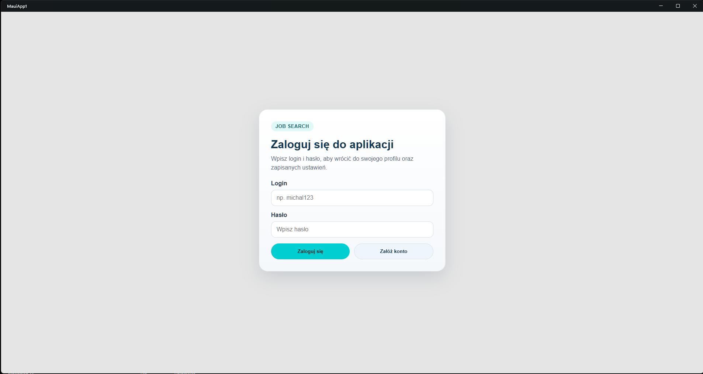
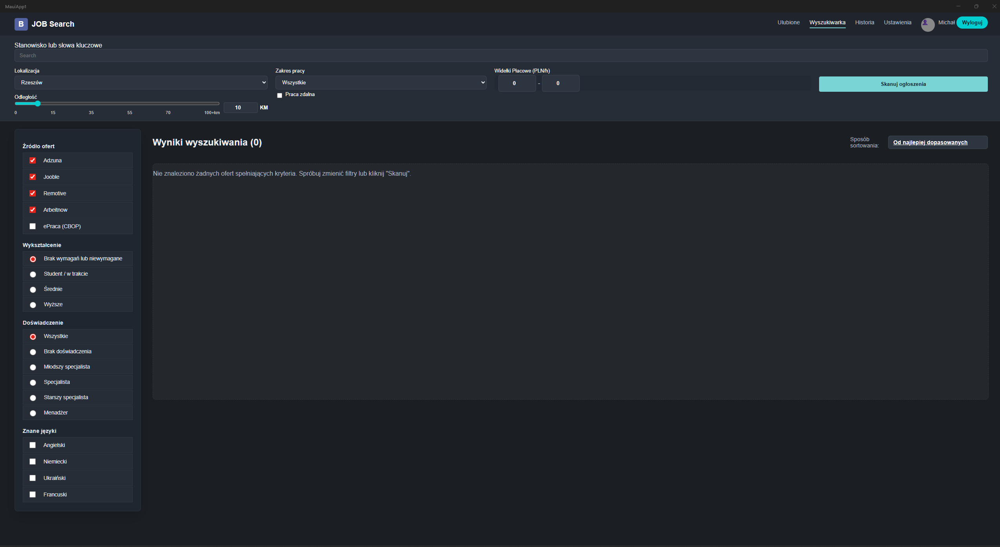
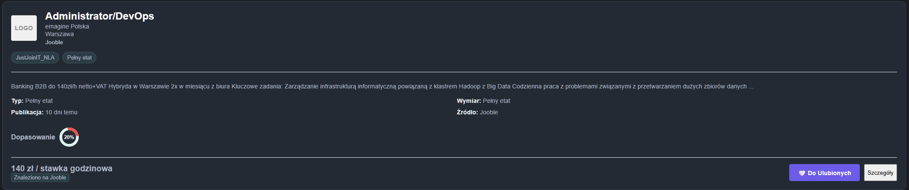
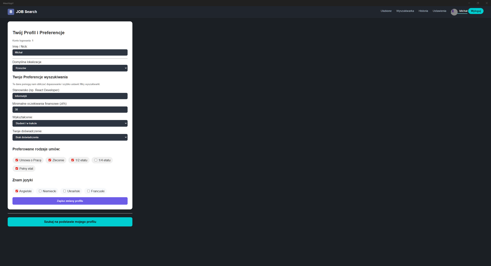
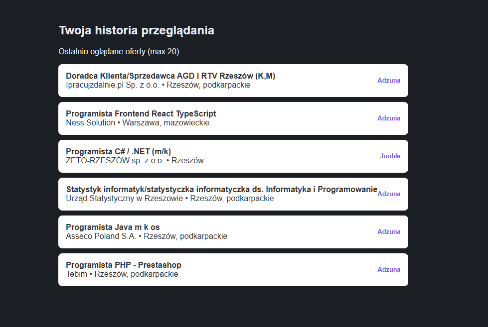
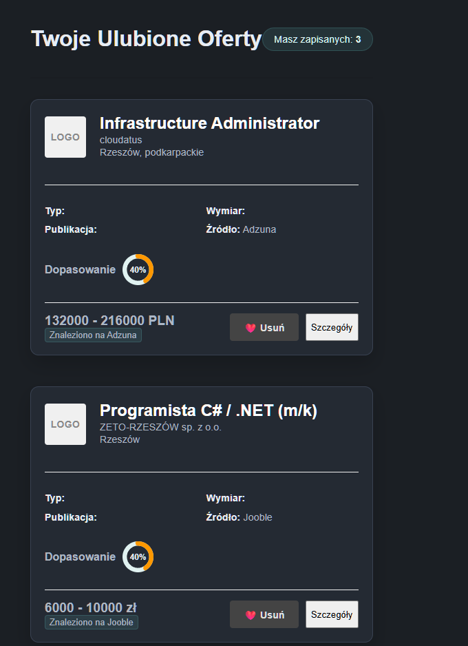

# Job Search AI — Dokumentacja Projektu

> Aplikacja do agregowania, filtrowania i inteligentnego dopasowywania ofert pracy z wielu źródeł, zbudowana w .NET 10 / Blazor Server z lokalną bazą PostgreSQL.

---

## Spis treści

1. [Cel aplikacji](#1-cel-aplikacji)
2. [Architektura rozwiązania](#2-architektura-rozwiązania)
3. [Model danych — schemat ERD](#3-model-danych--schemat-erd)
4. [Instrukcja uruchomienia środowiska projektowego](#4-instrukcja-uruchomienia-środowiska-projektowego)
5. [Pięć najważniejszych metod](#5-pięć-najważniejszych-metod)
6. [Zrzuty ekranów z kluczowych etapów działania](#6-zrzuty-ekranów-z-kluczowych-etapów-działania)
7. [Technologie](#7-technologie)
8. [Możliwe kierunki dalszego rozwoju](#8-możliwe-kierunki-dalszego-rozwoju)

---

## 1. Cel aplikacji

**Job Search AI** to wieloplatformowy system wspomagający poszukiwanie pracy, który rozwiązuje trzy kluczowe problemy użytkownika:

- **Rozproszenie danych** — oferty pracy znajdują się na wielu portalach jednocześnie (Adzuna, Jooble, Remotive, Arbeitnow). Aplikacja agreguje je w jednym miejscu.
- **Brak personalizacji** — użytkownik musi ręcznie przeszukiwać setki ogłoszeń. Aplikacja oblicza wynik dopasowania każdej oferty do profilu kandydata (słowa kluczowe, lokalizacja, wynagrodzenie, doświadczenie, wykształcenie, języki).
- **Ciągłe zapytania do zewnętrznych API** — aplikacja importuje dane do lokalnej bazy PostgreSQL, dzięki czemu wyszukiwanie jest szybkie i niezależne od limitów zewnętrznych serwisów.

**Główne funkcje:**
- Rejestracja i logowanie użytkowników z zaszyfrowanymi hasłami (SHA-256)
- Budowanie profilu kandydata (stanowisko, doświadczenie, wykształcenie, języki, preferowane formy zatrudnienia)
- Wyszukiwanie i filtrowanie ofert pracy z lokalnej bazy (do 2500 rekordów)
- Lokalny algorytm scoringu dopasowania ofert (0–100 pkt)
- Opcjonalne dopasowanie AI z użyciem Google Gemini
- Lista ulubionych ofert i historia przeglądania
- Wersja webowa (Blazor Server) oraz wersja mobilno-desktopowa (.NET MAUI)

---

## 2. Architektura rozwiązania

```
┌─────────────────────────────────────────────────────────────────────┐
│                        UŻYTKOWNIK                                   │
└────────────────────┬────────────────────────────────────────────────┘
                     │ HTTP / WebSocket
           ┌─────────▼──────────┐
           │  MauiApp1.Web       │   ← Blazor Server (ASP.NET Core)
           │  (port 5055)        │     Razor Components, Tailwind CSS
           └─────────┬──────────┘
                     │ Npgsql
           ┌─────────▼──────────┐
           │  PostgreSQL DB      │   ← Lokalna baza danych
           │  (localhost:5432)   │     schemat: public
           └─────────┬──────────┘
                     │
           ┌─────────▼──────────┐
           │  MauiApp1.Importer  │   ← Aplikacja konsolowa .NET
           │  (niezależny moduł) │     cykliczne pobieranie ofert
           └─────────┬──────────┘
                     │ HTTP
     ┌───────────────┼───────────────────────────┐
     │               │               │           │
┌────▼───┐    ┌──────▼──┐    ┌───────▼──┐  ┌────▼──────┐
│ Adzuna │    │  Jooble  │    │ Remotive │  │Arbeitnow  │
│  API   │    │  API     │    │  API     │  │  API      │
└────────┘    └─────────┘    └──────────┘  └───────────┘

           ┌──────────────────────┐
           │  MauiApp1 (MAUI)      │   ← Aplikacja natywna
           │  Windows/Android/iOS  │     (używa tej samej bazy)
           └──────────────────────┘
```

Projekt składa się z trzech modułów:

**MauiApp1.Web** — główna aplikacja użytkowa: interfejs Blazor Server, logika wyszukiwania, profil użytkownika, scoring ofert.

**MauiApp1.Importer** — aplikacja konsolowa uruchamiana niezależnie (ręcznie lub przez scheduler). Pobiera oferty z API, normalizuje dane i zapisuje je do PostgreSQL.

**MauiApp1** — pierwotna aplikacja .NET MAUI (wieloplatformowa). Zawiera tę samą logikę biznesową, ale działa jako aplikacja natywna.

---

## 3. Model danych — schemat ERD

```
┌──────────────────┐         ┌─────────────────────┐
│   job_sources    │         │   job_import_runs   │
├──────────────────┤         ├─────────────────────┤
│ id (PK)          │◄────────│ source_id (FK)      │
│ code             │    1    │ id (PK)             │
│ display_name     │    │    │ started_at          │
│ is_enabled       │    │    │ finished_at         │
│ last_success_at  │    │    │ status              │
│ created_at       │    │    │ fetched_count       │
│ updated_at       │    │    │ inserted_count      │
└──────────────────┘    │    │ updated_count       │
                        │    │ deactivated_count   │
                        │    │ error_message       │
                        │    └─────────────────────┘
                        │
                        │ N
┌───────────────────────▼────────────────────────────────┐
│                      job_offers                        │
├────────────────────────────────────────────────────────┤
│ id (PK)               │ salary_min / salary_max        │
│ source_id (FK)        │ salary_currency / salary_raw   │
│ external_id           │ employment_type                │
│ external_url          │ contract_type                  │
│ title                 │ experience_level               │
│ company_name          │ education_level                │
│ location_name         │ is_remote                      │
│ city / region         │ is_active                      │
│ country_code          │ published_at                   │
│ description           │ first_seen_at / last_seen_at   │
│ description_short     │ last_import_run_id (FK)        │
└────────────────┬───────────────────────────────────────┘
                 │
        ┌────────┴────────┐
        │                 │
┌───────▼────────┐  ┌─────▼──────────┐
│job_offer_langs │  │job_offer_tags  │
├────────────────┤  ├────────────────┤
│job_offer_id(FK)│  │job_offer_id(FK)│
│language_code   │  │tag             │
│language_name   │  └────────────────┘
└────────────────┘


┌─────────────┐        ┌──────────────────┐
│  app_users  │        │  user_profiles   │
├─────────────┤        ├──────────────────┤
│ id (PK)     │◄───────│ user_id (PK/FK)  │
│ login       │   1:1  │ username         │
│ password_   │        │ email            │
│  hash       │        │ default_location │
│ created_at  │        │ expected_salary  │
│ last_login_ │        │ job_title        │
│  at         │        │ experience       │
│ is_active   │        │ education        │
└──────┬──────┘        └──────────────────┘
       │
       │ 1:N
       │
       ├──────────────────────────────┐
       │                              │
┌──────▼───────────────┐   ┌──────────▼───────────────┐
│ user_profile_skills  │   │ user_profile_languages   │
├──────────────────────┤   ├──────────────────────────┤
│ user_id (FK)         │   │ user_id (FK)             │
│ skill_name           │   │ language_name            │
└──────────────────────┘   └──────────────────────────┘

┌──────────────────────────┐   ┌──────────────────────────┐
│user_profile_contract_    │   │  user_favorite_offers    │
│types                     │   ├──────────────────────────┤
├──────────────────────────┤   │ user_id (FK)             │
│ user_id (FK)             │   │ job_offer_id (FK)        │
│ contract_type            │   │ created_at               │
└──────────────────────────┘   └──────────────────────────┘

                               ┌──────────────────────────┐
                               │  user_search_history     │
                               ├──────────────────────────┤
                               │ id (PK)                  │
                               │ user_id (FK)             │
                               │ job_offer_id (FK)        │
                               │ title_snapshot           │
                               │ company_snapshot         │
                               │ external_url_snapshot    │
                               │ viewed_at                │
                               └──────────────────────────┘
```

**Widok pomocniczy:** `active_job_offers` — filtruje tylko aktywne oferty (`is_active = true`).

**Triggery automatyczne:** `set_updated_at()` — automatycznie aktualizuje pole `updated_at` przy każdej modyfikacji rekordów w tabelach `job_sources`, `job_offers`, `app_users`, `user_profiles`.

---

## 4. Instrukcja uruchomienia środowiska projektowego

### Wymagania wstępne

| Narzędzie | Wersja | Pobieranie |
|-----------|--------|------------|
| .NET SDK | 10.0+ | https://dotnet.microsoft.com/download |
| PostgreSQL | 15+ | https://www.postgresql.org/download/ |
| Visual Studio 2022 | 17.10+ (z workloadem ASP.NET i MAUI) | https://visualstudio.microsoft.com/ |

> Alternatywnie: Visual Studio Code z rozszerzeniem C# Dev Kit.

---

### Krok 1 — Sklonuj repozytorium

```bash
git clone <url-repozytorium>
cd MauiApp1
```

---

### Krok 2 — Utwórz bazę danych PostgreSQL

Otwórz terminal z psql lub pgAdmin i wykonaj:

```sql
CREATE DATABASE job_platform;
```

Następnie zastosuj schemat:

```bash
psql -U postgres -d job_platform -f MauiApp1/database/local_postgres_job_platform_schema.sql
```

---

### Krok 3 — Skonfiguruj connection string dla aplikacji webowej

Otwórz plik `MauiApp1.Web/appsettings.json` i uzupełnij sekcję:

```json
{
  "Database": {
    "ConnectionString": "Host=localhost;Port=5432;Database=job_platform;Username=postgres;Password=TWOJE_HASLO"
  },
  "JobSources": {
    "Adzuna": {
      "AppId": "TWOJ_ADZUNA_APP_ID",
      "AppKey": "TWOJ_ADZUNA_APP_KEY"
    },
    "Jooble": {
      "ApiKey": "TWOJ_JOOBLE_API_KEY"
    },
    "EPraca": {
      "PartnerName": ""
    }
  }
}
```

> Klucze API Adzuna i Jooble są opcjonalne — aplikacja działa bez nich (wyświetla dane z bazy lokalnej). Źródła Remotive i Arbeitnow nie wymagają kluczy API.

---

### Krok 4 — Skonfiguruj i uruchom importer danych

Otwórz `MauiApp1.Importer/appsettings.json` i uzupełnij:

```json
{
  "Database": {
    "ConnectionString": "Host=localhost;Port=5432;Database=job_platform;Username=postgres;Password=TWOJE_HASLO"
  },
  "Sources": {
    "Adzuna": { "Enabled": true, "AppId": "...", "AppKey": "..." },
    "Jooble":  { "Enabled": true, "ApiKey": "..." },
    "Remotive": { "Enabled": true },
    "Arbeitnow": { "Enabled": true }
  },
  "Import": {
    "MaxPagesPerQuery": 5,
    "DeactivateMissingOffers": true
  }
}
```

Uruchom importer (pierwsze zasilenie bazy):

```bash
dotnet run --project MauiApp1.Importer/MauiApp1.Importer.csproj
```

---

### Krok 5 — Uruchom aplikację webową

```bash
dotnet run --project MauiApp1.Web/MauiApp1.Web.csproj --urls http://0.0.0.0:5055
```

Otwórz przeglądarkę pod adresem:

```
http://localhost:5055
```

---

### Krok 6 —  Uruchom aplikację MAUI na Windows

W Visual Studio 2022:
1. Ustaw `MauiApp1` jako projekt startowy
2. Wybierz target: `Windows Machine`
3. Naciśnij `F5` lub `Ctrl+F5`

Ewentualnie możliwość odpalenia bezpośrednio z pliku MauiApp1.exe   

---

### Krok 7 — (Opcjonalnie) Udostępnij aplikację webową zewnętrznie

**Cloudflare Tunnel** (jednorazowy link HTTPS):

```bash
cloudflared tunnel --url http://localhost:5055
```

**Tailscale** (sieć prywatna):
Uruchom aplikację i udostępnij adres IP urządzenia w sieci Tailscale na porcie 5055.

---

### Podsumowanie kroków

```
[1] git clone  →  [2] CREATE DATABASE  →  [3] appsettings.json
      →  [4] dotnet run Importer  →  [5] dotnet run Web  →  [6] localhost:5055
```

---

## 5. Pięć najważniejszych metod

### Metoda 1 — `SearchJobsOnlineAsync`

**Plik:** `MauiApp1.Web/testowe/JobSearchService.cs`  
**Sygnatura:** `public async Task SearchJobsOnlineAsync(string query, string location)`

Jest to **centralny punkt wejścia** do całego procesu wyszukiwania ofert. Łączy warstwę UI z logiką biznesową.

**Co robi metoda:**

```csharp
public async Task SearchJobsOnlineAsync(string query, string location)
{
    // 1. Resetuje stan wyszukiwania i ustawia flagę ładowania
    IsLoading = true;
    StatusMessage = "Pobieram oferty z bazy danych...";
    AllJobOffers = new List<JobOffer>();

    // 2. Waliduje konfigurację i wybrane źródła
    var selectedSources = SourceFilters.Where(s => s.Value).Select(s => s.Key).ToList();
    if (!_jobReader.IsConfigured) { StatusMessage = "Brak konfiguracji bazy."; return; }

    // 3. Pobiera aktywne oferty z PostgreSQL
    var offers = await _jobReader.LoadActiveOffersAsync(selectedSources);

    // 4. Oblicza wynik dopasowania dla każdej oferty
    foreach (var offer in AllJobOffers)
        offer.MatchScore = CalculateMatchingScore(offer);

    // 5. Sortuje wyniki i aktualizuje UI
    AllJobOffers = AllJobOffers.OrderByDescending(o => o.MatchScore).ToList();
    StatusMessage = BuildStatusMessage(_loadedSearchResults.Count);
}
```

**Dlaczego jest ważna:** Bez tej metody kliknięcie przycisku „Skanuj ogłoszenia" w UI nie dałoby żadnego efektu. Metoda zarządza cyklem życia zapytania: reset stanu → pobranie danych → scoring → sortowanie → powiadomienie UI przez `NotifyStateChanged()`.

---

### Metoda 2 — `CalculateMatchingScore`

**Plik:** `MauiApp1.Web/testowe/JobSearchService.cs`  
**Sygnatura:** `public int CalculateMatchingScore(JobOffer offer)`

Implementuje **lokalny algorytm scoringu** — główny mechanizm oceny trafności ofert, działający bez zewnętrznych API.

**Schemat punktacji:**

| Kryterium | Punkty |
|-----------|--------|
| Zgodność słów kluczowych / tytułu | +20 |
| Zgodna lokalizacja | +20 |
| Zgodny zakres/forma pracy | +20 |
| Wynagrodzenie ≥ minimum (lub do uzgodnienia) | +5 do +10 |
| Zgodny poziom wykształcenia | +5 do +10 |
| Zgodny poziom doświadczenia | +5 do +10 |
| Wymagany język spośród znanych przez użytkownika | +10 |

```csharp
public int CalculateMatchingScore(JobOffer offer)
{
    var score = 0;
    if (!string.IsNullOrWhiteSpace(query) && MatchesSearchQuery(offer, query))
        score += 20;
    if (offer.Location.Contains(Location, StringComparison.OrdinalIgnoreCase))
        score += 20;
    // ... pozostałe kryteria
    return Math.Clamp(score, 0, 100);
}
```

**Dlaczego jest ważna:** Jest to serce systemu rekomendacyjnego. Działa zawsze — nawet gdy integracja z Gemini AI jest niedostępna. Wynik `MatchScore` steruje kolejnością wyświetlania ofert na liście.

---

### Metoda 3 — `LoadActiveOffersAsync`

**Plik:** `MauiApp1.Web/testowe/PostgresJobReader.cs`  
**Sygnatura:** `public async Task<List<JobOffer>> LoadActiveOffersAsync(IEnumerable<string> selectedSources)`

Centralny punkt odczytu danych z bazy PostgreSQL — **główne zapytanie SQL całej aplikacji**.

**Co robi metoda:**

```csharp
public async Task<List<JobOffer>> LoadActiveOffersAsync(IEnumerable<string> selectedSources)
{
    const string sql = """
        select jo.title, jo.company_name, jo.location_name, jo.salary_raw,
               jo.description_short, jo.experience_level, jo.education_level,
               js.display_name, jo.external_url, jo.employment_type, jo.contract_type,
               jo.published_at, jo.is_remote,
               array_agg(distinct jol.language_name) as languages,
               array_agg(distinct jot.tag) as tags
        from public.job_offers jo
        join public.job_sources js on js.id = jo.source_id
        left join public.job_offer_languages jol on jol.job_offer_id = jo.id
        left join public.job_offer_tags jot on jot.job_offer_id = jo.id
        where jo.is_active = true
          and (@source_count = 0 or js.code = any(@sources))
        group by jo.id, js.display_name
        order by coalesce(jo.published_at, jo.created_at) desc
        limit 2500;
    """;
    // mapuje wyniki na List<JobOffer>
}
```

**Dlaczego jest ważna:** Dzięki temu zapytaniu aplikacja jest niezależna od limitów zewnętrznych API podczas normalnego użytkowania. Jedno dobrze zindeksowane zapytanie zastępuje wiele równoległych wywołań HTTP. Używa parametryzowanego filtrowania po kodach źródeł, co zapobiega SQL injection.

---

### Metoda 4 — `FetchAllAsync`

**Plik:** `MauiApp1.Importer/SourceClients.cs`  
**Sygnatura:** `public async Task<Dictionary<string, List<NormalizedJobOffer>>> FetchAllAsync()`

Główna metoda importera — **orkiestrator pobierania danych ze wszystkich źródeł**.

**Co robi metoda:**

```csharp
public async Task<Dictionary<string, List<NormalizedJobOffer>>> FetchAllAsync()
{
    var result = new Dictionary<string, List<NormalizedJobOffer>>(StringComparer.OrdinalIgnoreCase);

    if (_settings.Sources.Adzuna.Enabled)
        result[_settings.Sources.Adzuna.Code] = await FetchAdzunaAsync();

    if (_settings.Sources.Jooble.Enabled)
        result[_settings.Sources.Jooble.Code] = await FetchJoobleAsync();

    if (_settings.Sources.Remotive.Enabled)
        result[_settings.Sources.Remotive.Code] = await FetchRemotiveAsync();

    if (_settings.Sources.Arbeitnow.Enabled)
        result[_settings.Sources.Arbeitnow.Code] = await FetchArbeitnowAsync();

    return result;
}
```

**Dlaczego jest ważna:** Metoda umożliwia **modularną konfigurację źródeł** — każde z nich można włączyć lub wyłączyć w `appsettings.json` bez modyfikacji kodu. Wzorzec słownika `sourceCode → lista ofert` pozwala następnie przetworzyć każde źródło niezależnie w pętli w `Program.cs`. To serce importera zasilającego całą bazę danych.

---

### Metoda 5 — `UpsertOffersAsync`

**Plik:** `MauiApp1.Importer/PostgresJobRepository.cs`  
**Sygnatura:** `public async Task<ImportStats> UpsertOffersAsync(SourceImportContext context, string sourceCode, List<NormalizedJobOffer> offers)`

Implementuje mechanizm **upsert** — wstawia nowe oferty lub aktualizuje już istniejące, bez tworzenia duplikatów.

**Co robi metoda:**

```csharp
public async Task<ImportStats> UpsertOffersAsync(
    SourceImportContext context,
    string sourceCode,
    List<NormalizedJobOffer> offers)
{
    foreach (var offer in offers)
    {
        // INSERT ... ON CONFLICT (source_id, external_id) DO UPDATE SET ...
        // — wstawia nową ofertę lub aktualizuje istniejącą
        // — zapisuje języki do job_offer_languages
        // — zapisuje tagi do job_offer_tags
        // — zlicza statystyki (inserted/updated)
    }

    if (DeactivateMissingOffers)
    {
        // oznacza oferty niewidziane w bieżącym imporcie jako is_active = false
    }

    return stats; // ImportStats { InsertedCount, UpdatedCount, DeactivatedCount }
}
```

**Dlaczego jest ważna:** Bez mechanizmu upsert każde ponowne uruchomienie importera tworzyłoby duplikaty. Metoda gwarantuje spójność bazy danych: oferty, które zniknęły ze źródła, są deaktywowane (`is_active = false`), a nie fizycznie usuwane — co pozwala zachować historię. Klucz unikalności `(source_id, external_id)` jest egzekwowany na poziomie bazy danych.

---

## 6. Zrzuty ekranów z kluczowych etapów działania

### Ekran 1 — Strona logowania (`/login`)

Użytkownik wprowadza login i hasło. System weryfikuje dane przez porównanie z hashem SHA-256 w bazie. Po zalogowaniu preferencje profilu są automatycznie stosowane jako filtry wyszukiwania.



---

### Ekran 2 — Główny widok wyszukiwania (`/`)

Centralny panel aplikacji. Widoczne są:
- pole wyszukiwania (słowa kluczowe + lokalizacja),
- filtry (wynagrodzenie, forma zatrudnienia, poziom doświadczenia, wykształcenie, języki, zdalna praca),
- lista ofert posortowanych malejąco wg. `MatchScore` z widocznym wskaźnikiem dopasowania,
- stronicowanie (20 ofert na stronę).



---

### Ekran 3 — Karta oferty pracy (`JobCard`)

Komponent wyświetlający szczegóły pojedynczej oferty: tytuł, firma, lokalizacja, wynagrodzenie, tagi, poziom doświadczenia, opis, wynik dopasowania z uzasadnieniem (`MatchReason`), przycisk „Dodaj do ulubionych" i link do oferty na stronie zewnętrznej.



---

### Ekran 4 — Profil użytkownika (`/profile`)

Formularz edycji profilu: stanowisko docelowe, preferowana lokalizacja, oczekiwane wynagrodzenie, poziom doświadczenia, wykształcenie, znane języki, preferowane formy zatrudnienia. Przycisk „Zastosuj profil" aktualizuje filtry wyszukiwania.


---

### Ekran 5 — Historia i ulubione (`/history`, `/ulubione`)

Lista ostatnio przeglądanych ofert (max 20 rekordów) oraz lista ofert oznaczonych jako ulubione, z możliwością szybkiego powrotu do oferty przez link zewnętrzny.




---

## 7. Technologie

| Technologia | Wersja | Zastosowanie |
|-------------|--------|--------------|
| C# / .NET | 10.0 | Główny język i platforma |
| ASP.NET Core / Blazor Server | 10.0 | Aplikacja webowa, komponenty UI |
| .NET MAUI | 10.0 | Natywna aplikacja wieloplatformowa |
| PostgreSQL | 15+ | Relacyjna baza danych |
| Npgsql | 9.x | Sterownik ADO.NET dla PostgreSQL |
| Newtonsoft.Json | 13.x | Deserializacja odpowiedzi z API |
| Microsoft.Extensions.Configuration | 10.0 | Konfiguracja przez `appsettings.json` |
| Google Gemini API | (opcjonalnie) | Zaawansowane dopasowanie AI |
| HTML / CSS / Razor Components | — | Warstwa interfejsu użytkownika |

---

## 8. Możliwe kierunki dalszego rozwoju

- **Automatyczne importy** — uruchamianie importera według harmonogramu (np. Task Scheduler / cron / Hangfire)
- **Wyszukiwanie semantyczne** — indeksowanie wektorowe opisów ofert (pgvector + embedding model)
- **Ulepszony panel AI** — pełna integracja z Gemini dla wyjaśnień dopasowania i rekomendacji
- **Panel administracyjny** — zarządzanie źródłami, podgląd statystyk importów, zarządzanie użytkownikami
- **Powiadomienia e-mail** — alerty o nowych ofertach pasujących do profilu
- **Eksport wyników** — PDF / CSV z listą ofert
- **Rozbudowa źródeł** — integracja z ePraca (CBOP), LinkedIn, NoFluffJobs, Pracuj.pl

---
